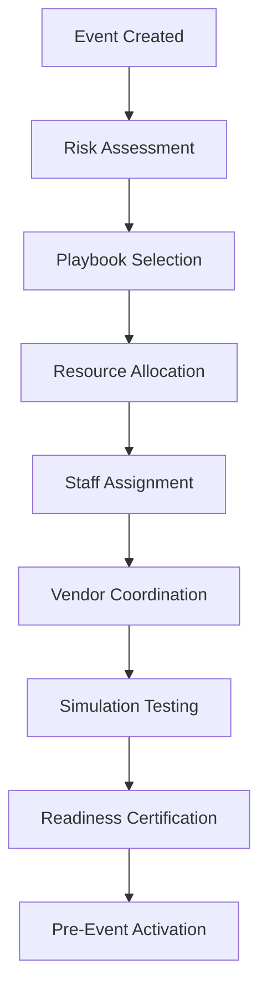
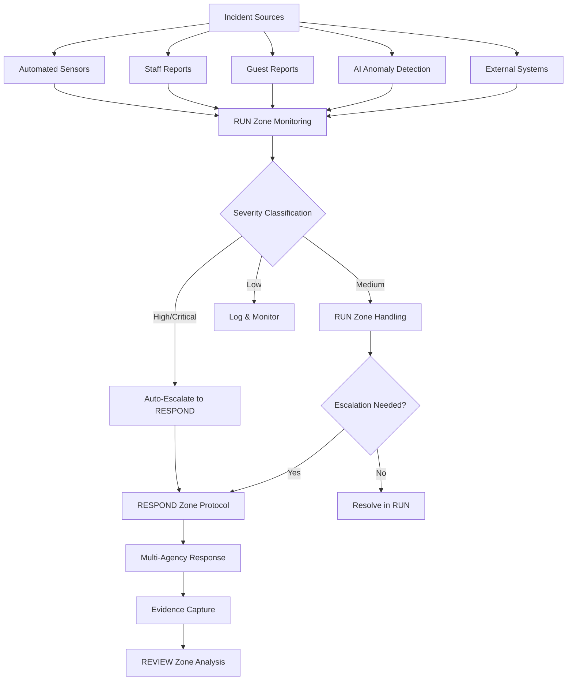
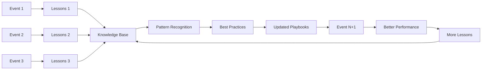

# EVERGAME Cross-Zone Workflows
## End-to-End Operational Intelligence Flows

**Version**: 1.0  
**Last Updated**: January 2026  
**Status**: Production Ready  
**Classification**: Technical Integration Guide

---

## Introduction

The EVERGAME framework's true power emerges not from individual zones operating in isolation, but from the seamless flow of intelligence, context, and learning across all four zones. This document details the complete operational workflows that traverse PREPARE → RUN → RESPOND → REVIEW, creating a continuous improvement cycle.

### How Data Flows Through EVERGAME

```
┌─────────────────────────────────────────────────────────────┐
│                   INTELLIGENCE FLOW                          │
│                                                              │
│  ┌──────────┐                                               │
│  │ PREPARE  │  Baselines, Plans, Playbooks                  │
│  │  Zone 1  │──────────────────────┐                        │
│  └──────────┘                      ▼                        │
│       ▲                        ┌──────────┐                 │
│       │                        │   RUN    │  Performance,   │
│       │                        │  Zone 2  │  Execution      │
│       │                        └──────────┘                 │
│       │                             │                        │
│       │                             ▼                        │
│  ┌──────────┐                 ┌──────────┐                 │
│  │  REVIEW  │◄────────────────│ RESPOND  │  Incidents,     │
│  │  Zone 4  │  Evidence,      │  Zone 3  │  Evidence       │
│  └──────────┘  Resolution     └──────────┘                 │
│       │                                                      │
│       │  Insights, Recommendations                          │
│       └──────────────────────────────────────┘             │
│                                                              │
│              ┌────────────────────────┐                     │
│              │   Evidence Ledger       │                     │
│              │  (Blockchain Storage)   │                     │
│              └────────────────────────┘                     │
│                      ▲  │  ▲  │                             │
│              ┌───────┘  │  │  └────────┐                   │
│              │   All Zones Write/Read   │                   │
│              └──────────────────────────┘                   │
└─────────────────────────────────────────────────────────────┘
```

---

## Workflow 1: Complete Event Lifecycle

**Flow**: PREPARE → RUN → RESPOND (if needed) → REVIEW → PREPARE

This workflow represents the standard operational cycle for a planned event, showing how intelligence flows through all four zones.

### Phase 1: Pre-Event Planning (PREPARE Zone)

**Timeline**: T-30 days to T-0



#### Detailed Steps

**T-30 Days: Event Creation & Initial Planning**

```typescript
// API Call: Create Event
POST /api/prepare/events
{
  "name": "Week 15 Home Game",
  "eventType": "nfl_regular_season",
  "date": "2026-12-20T13:00:00Z",
  "expectedAttendance": 68000,
  "weatherSensitive": true
}

// Database Tables Touched
- events (insert)
- event_plans (insert)
- scenarios (link existing)

// State Transition
Event: null → DRAFT
```

**T-28 Days: Risk Assessment**

```typescript
// API Call: Generate Risk Assessment
POST /api/prepare/risk/assess
{
  "eventId": "evt_abc123",
  "assessmentType": "comprehensive",
  "factors": ["weather", "crowd", "security", "medical", "operational"]
}

// SIPE Engine Processing
1. Historical data analysis (previous games at this venue)
2. Weather pattern prediction (December in this region)
3. Crowd behavior modeling (division rival, playoff implications)
4. Threat intelligence integration (current security landscape)
5. Equipment reliability scoring (predictive maintenance data)

// Output: Risk Score Matrix
{
  "overallRiskScore": 67, // 0-100 scale
  "categories": {
    "weather": { "score": 72, "mitigations": 4 },
    "crowd": { "score": 58, "mitigations": 6 },
    "security": { "score": 45, "mitigations": 8 },
    "medical": { "score": 51, "mitigations": 3 },
    "operational": { "score": 62, "mitigations": 5 }
  }
}

// Database Tables Touched
- risk_assessments (insert)
- risk_factors (multiple inserts)
- mitigation_strategies (link existing + create new)

// Evidence Ledger Entry
{
  "type": "risk_assessment_completed",
  "eventId": "evt_abc123",
  "riskScore": 67,
  "timestamp": "2026-11-20T10:30:00Z",
  "actor": "usr_risk_officer",
  "hash": "0x8f7d..."
}
```

**T-21 Days: Playbook Selection & Customization**

```typescript
// API Call: Select Base Playbook
POST /api/prepare/playbooks/evt_abc123/assign
{
  "templateId": "plybk_nfl_standard",
  "customizations": {
    "weatherContingencies": true,
    "rivalGameProtocols": true,
    "playoffImplications": true
  }
}

// Playbook Adaptation Logic
if (riskScore.weather > 70) {
  playbook.addContingency("lightning_protocol");
  playbook.addContingency("severe_weather_evacuation");
  playbook.increaseStaffing("weather_monitoring", 1.5);
}

if (rivalGame && playoffImplications) {
  playbook.increaseStaffing("security", 1.3);
  playbook.activateProtocol("enhanced_crowd_management");
  playbook.addCheckpoint("post_game_traffic_management");
}

// Database Tables Touched
- playbooks (insert new version)
- playbook_steps (multiple inserts)
- playbook_conditions (conditional logic)
- playbook_assignments (staff assignments)

// State Transition
Playbook: DRAFT → UNDER_REVIEW
```

**T-14 Days: Resource Allocation & Scheduling**

```typescript
// API Call: Generate Resource Plan
POST /api/prepare/resources/allocate
{
  "eventId": "evt_abc123",
  "playbookId": "plybk_123",
  "optimizationCriteria": ["cost", "coverage", "redundancy"]
}

// Resource Optimization Engine
1. Analyze playbook requirements (500 staff, 200 equipment items)
2. Check availability (staff schedules, equipment maintenance)
3. Identify gaps (20 security staff shortage)
4. Recommend solutions (request mutual aid, hire temp staff)
5. Optimize schedules (minimize overtime, maximize coverage)

// Output: Resource Plan
{
  "staffing": {
    "total": 520,
    "byDepartment": {
      "security": 180,
      "operations": 120,
      "medical": 40,
      "guest_services": 100,
      "facilities": 80
    },
    "gaps": [],
    "overtimeHours": 45
  },
  "equipment": {
    "total": 215,
    "byCategory": {
      "communications": 50,
      "medical": 30,
      "safety": 60,
      "operational": 75
    },
    "maintenanceRequired": 3,
    "backupUnits": 15
  }
}

// Database Tables Touched
- resource_assignments (multiple inserts)
- staff_schedules (multiple inserts)
- equipment_inventory (status updates)
- vendor_registry (coordination requests)
```

**T-7 Days: Simulation & Testing**

```typescript
// API Call: Run Comprehensive Simulation
POST /api/prepare/simulations/evt_abc123/run
{
  "scenarioType": "full_lifecycle",
  "includeEmergencies": true,
  "stressTests": ["capacity", "weather", "incident"]
}

// Digital Twin Simulation
1. Model complete event timeline
2. Inject stress scenarios
   - Lightning strike at T+2:15 (3rd quarter)
   - Medical emergency at T+0:45 (pre-game)
   - Equipment failure at T+1:30 (halftime)
3. Measure response times
4. Validate playbook logic
5. Identify bottlenecks

// Simulation Results
{
  "overallScore": 87, // 0-100
  "scenarios": [
    {
      "type": "lightning_strike",
      "detectionTime": 28, // seconds
      "responseTime": 142, // seconds
      "evacuationTime": 456, // seconds (7:36)
      "passed": true,
      "notes": "Under 8-minute target"
    },
    {
      "type": "medical_emergency",
      "detectionTime": 12,
      "responseTime": 178,
      "resolutionTime": 420,
      "passed": true,
      "notes": "AED deployed in 2:58"
    },
    {
      "type": "equipment_failure",
      "detectionTime": 45,
      "responseTime": 89,
      "resolutionTime": 312,
      "passed": true,
      "notes": "Backup system activated"
    }
  ],
  "bottlenecks": [
    "Communication delay to external agencies (38s)"
  ],
  "recommendations": [
    "Pre-position additional EMS unit in Section 200"
  ]
}

// Database Tables Touched
- simulations (insert)
- simulation_results (insert)
- playbook_revisions (potential updates based on results)
```

**T-1 Day: Final Readiness Certification**

```typescript
// API Call: Calculate Readiness Score
POST /api/prepare/readiness/calculate
{
  "eventId": "evt_abc123"
}

// Readiness Calculation Algorithm
readinessScore = weighted_average([
  staff_readiness * 0.25,      // 100% trained, 98% available
  equipment_readiness * 0.20,   // 97% operational
  playbook_readiness * 0.15,    // Tested, approved
  compliance_readiness * 0.15,  // All checks passed
  vendor_readiness * 0.10,      // All vendors confirmed
  risk_mitigation * 0.15        // All high risks mitigated
])

// Output
{
  "readinessScore": 94,
  "status": "CERTIFIED",
  "breakdown": {
    "staffReadiness": 99,
    "equipmentReadiness": 97,
    "playbookReadiness": 95,
    "complianceReadiness": 100,
    "vendorReadiness": 88,
    "riskMitigation": 91
  },
  "remainingTasks": [
    "Final weather brief at T-2 hours",
    "Equipment check at T-4 hours"
  ],
  "certificationTimestamp": "2026-12-19T18:00:00Z"
}

// State Transitions
Event: APPROVED → READY
Playbook: CERTIFIED → READY

// Evidence Ledger Entry
{
  "type": "event_certified",
  "eventId": "evt_abc123",
  "readinessScore": 94,
  "certifiedBy": "usr_ops_director",
  "timestamp": "2026-12-19T18:00:00Z",
  "hash": "0x3a2f..."
}
```

**T-0: Event Activation & Handoff to RUN Zone**

```typescript
// Integration Event: PREPARE → RUN
eventBus.publish({
  type: 'event.activated',
  source: 'prepare',
  target: 'run',
  payload: {
    eventId: 'evt_abc123',
    playbookId: 'plybk_123',
    readinessScore: 94,
    resourceAllocations: {...},
    staffAssignments: {...},
    riskAssessments: {...},
    emergencyProtocols: {...}
  },
  timestamp: '2026-12-20T09:00:00Z',
  correlationId: 'evt_abc123'
});

// RUN Zone Receipt
const activateEvent = async (event: IntegrationEvent) => {
  // 1. Create active_event record
  await db.active_events.insert({
    eventId: event.payload.eventId,
    status: 'PRE_EVENT',
    startTime: '2026-12-20T13:00:00Z',
    readinessScore: event.payload.readinessScore
  });
  
  // 2. Load playbook for execution
  await db.playbook_executions.insert({
    playbookId: event.payload.playbookId,
    eventId: event.payload.eventId,
    status: 'LOADED',
    currentStep: 1
  });
  
  // 3. Deploy resources
  await deployResources(event.payload.resourceAllocations);
  
  // 4. Notify staff
  await notifyStaff(event.payload.staffAssignments);
  
  // 5. Initialize monitoring
  await initializeMonitoring(event.payload.eventId);
};

// Database Tables Touched (RUN Zone)
- active_events (insert)
- playbook_executions (insert)
- active_resources (multiple inserts)
- system_metrics (begin collection)
```

### Phase 2: Event Execution (RUN Zone)

**Timeline**: T+0 to T+4 hours

#### Live Operations Flow

**T+0 to T+0:30: Pre-Event Operations**

```typescript
// Playbook Execution Begins
POST /api/run/playbooks/exec_123/activate

// Automated Task Orchestration
playbook.steps.forEach(step => {
  if (step.trigger === 'pre_event') {
    assignTask(step.assignee, step.task);
    monitorCompletion(step.id);
  }
});

// Real-Time Monitoring Activated
WebSocket: /api/run/metrics/evt_abc123/stream

// Monitoring Feeds
{
  "gates": {
    "status": "opening_sequence",
    "gatesOpen": 12,
    "gatesTotal": 24,
    "anticipatedDelay": 0
  },
  "crowd": {
    "arriving": 3200,
    "density": "low",
    "bottlenecks": []
  },
  "systems": {
    "operational": 47,
    "total": 50,
    "critical_failures": 0,
    "warnings": 3
  },
  "weather": {
    "current": "partly_cloudy",
    "temperature": 42,
    "windSpeed": 8,
    "precipitationChance": 20,
    "lightningRisk": "low"
  }
}

// Database Tables Touched
- playbook_executions (status updates)
- task_executions (multiple inserts)
- system_metrics (continuous inserts)
- crowd_metrics (continuous inserts)
- environment_conditions (continuous updates)
```

**T+1:00 to T+2:30: Main Event Period**

```typescript
// Continuous Performance Tracking
GET /api/run/performance/snapshot

{
  "timestamp": "2026-12-20T14:30:00Z",
  "eventPhase": "active",
  "attendance": 67432,
  "kpis": {
    "guestSatisfaction": 4.6,
    "concessionWaitTime": 4.2, // minutes
    "restroomWaitTime": 2.1,
    "incidents": 2,
    "slaCompliance": 98
  },
  "revenue": {
    "concessions": 342000,
    "merchandise": 189000,
    "parking": 67000
  },
  "alerts": [
    {
      "type": "crowd_density",
      "location": "Section 118 Concourse",
      "severity": "medium",
      "status": "monitoring"
    },
    {
      "type": "equipment_performance",
      "equipment": "HVAC Unit 3",
      "severity": "low",
      "status": "scheduled_maintenance"
    }
  ]
}

// Predictive Alerting Active
{
  "predictions": [
    {
      "type": "crowd_bottleneck",
      "location": "East Exit Gates",
      "timeframe": "post_game",
      "probability": 0.78,
      "recommendation": "Pre-deploy traffic control +2 staff"
    },
    {
      "type": "concession_shortage",
      "item": "Hot Dogs - Stand 12",
      "timeframe": "15_minutes",
      "probability": 0.92,
      "recommendation": "Transfer inventory from Stand 7"
    }
  ]
}

// Database Tables Touched
- operational_metrics (continuous updates)
- performance_snapshots (periodic captures)
- anomaly_detections (AI-identified issues)
- predictive_alerts (forecasted issues)
```

**T+2:15: INCIDENT DETECTED - Workflow Branches to RESPOND**

```typescript
// Anomaly Detection Triggers Alert
{
  "type": "weather_threat_detected",
  "severity": "high",
  "details": {
    "threat": "lightning",
    "distance": "6.8 miles",
    "approaching": true,
    "estimatedArrival": "12 minutes",
    "nflRuleViolation": true // 8-mile rule
  },
  "autoEscalate": true
}

// Integration Event: RUN → RESPOND
eventBus.publish({
  type: 'incident.detected',
  source: 'run',
  target: 'respond',
  payload: {
    eventId: 'evt_abc123',
    incidentType: 'weather_lightning',
    severity: 'high',
    location: 'venue_wide',
    currentAttendance: 67432,
    eventPhase: 'third_quarter',
    weatherData: {...},
    contextData: {
      playbookExecutionId: 'exec_123',
      currentTasks: [...],
      activeResources: [...]
    }
  },
  timestamp: '2026-12-20T15:15:00Z',
  correlationId: 'evt_abc123'
});

// RUN Zone State Transition
ActiveEvent: ACTIVE → INCIDENT

// Continue to Phase 3 (RESPOND Zone)
```

### Phase 3: Emergency Response (RESPOND Zone)

**Timeline**: Incident Detection to Resolution

#### Incident Response Flow

**T+2:15:28 (28 seconds after detection): Response Activated**

```typescript
// RESPOND Zone Receipt of Incident
POST /api/respond/incidents
{
  "eventId": "evt_abc123",
  "type": "weather_lightning",
  "source": "automated_detection",
  "severity": "high",
  "detectedAt": "2026-12-20T15:15:00Z",
  "contextData": {...}
}

// Automatic Classification
const classification = await classifyIncident({
  type: 'weather_lightning',
  distance: 6.8,
  approaching: true,
  attendance: 67432
});

// Result
{
  "responseLevel": "CODE_YELLOW",
  "protocol": "lightning_evacuation",
  "requiredAgencies": [
    "venue_security",
    "venue_operations",
    "medical",
    "local_police",
    "weather_monitoring"
  ],
  "estimatedDuration": "30-60 minutes",
  "complianceRequirements": [
    "NFL 8-mile rule",
    "Local emergency ordinances"
  ]
}

// State Transition
Incident: null → DETECTED → CLASSIFIED (28 seconds)

// Evidence Ledger Entry
{
  "type": "incident_detected",
  "incidentId": "inc_789",
  "severity": "high",
  "classification": "CODE_YELLOW",
  "timestamp": "2026-12-20T15:15:28Z",
  "hash": "0x9b4c..."
}
```

**T+2:15:38 (38 seconds): Multi-Agency Notification**

```typescript
// Protocol Activation
POST /api/respond/protocols/lightning_evac/activate
{
  "incidentId": "inc_789",
  "executionMode": "automated"
}

// Automated Alert Cascade
const notifications = [
  {
    to: 'venue_security_chief',
    channel: 'sms+app+radio',
    message: 'CODE YELLOW: Lightning 6.8mi, evacuate to concourses',
    priority: 'critical',
    requireAck: true
  },
  {
    to: 'venue_operations_director',
    channel: 'sms+app',
    message: 'CODE YELLOW: Lightning protocol activated, suspend outdoor ops',
    priority: 'critical',
    requireAck: true
  },
  {
    to: 'medical_command',
    channel: 'radio+app',
    message: 'CODE YELLOW: Position for potential lightning injuries',
    priority: 'high',
    requireAck: true
  },
  {
    to: 'local_police_liaison',
    channel: 'sms',
    message: 'Weather evacuation in progress, traffic management needed',
    priority: 'high',
    requireAck: false
  },
  {
    to: 'all_fans',
    channel: 'pa+app+sms',
    message: 'Please proceed to covered concourse areas due to lightning',
    priority: 'medium',
    requireAck: false
  }
];

await Promise.all(
  notifications.map(notif => sendAlert(notif))
);

// Delivery Tracking
{
  "totalSent": 67438, // includes all fans
  "criticalAcknowledged": 3, // of 3 required
  "deliveryTime": {
    "p50": 2.1, // seconds
    "p95": 4.8,
    "p99": 8.2
  },
  "failedDeliveries": 47 // fans with notifications disabled
}

// Database Tables Touched
- response_activations (insert)
- emergency_alerts (multiple inserts)
- alert_deliveries (thousands of inserts)
- alert_acknowledgments (tracking)
```

**T+2:15:58 to T+2:23:00: Evacuation Execution**

```typescript
// Real-Time Coordination Dashboard
GET /api/respond/responses/resp_456/coordination

{
  "responseId": "resp_456",
  "status": "responding",
  "timeline": [
    {
      "time": "T+0:28",
      "event": "Incident detected and classified"
    },
    {
      "time": "T+0:38",
      "event": "All agencies notified"
    },
    {
      "time": "T+0:58",
      "event": "Evacuation begun"
    },
    {
      "time": "T+1:45",
      "event": "50% evacuated to covered areas"
    },
    {
      "time": "T+2:30",
      "event": "75% evacuated"
    }
  ],
  "teams": [
    {
      "agency": "venue_security",
      "personnel": 180,
      "status": "deployed",
      "locations": ["all_gates", "concourses"]
    },
    {
      "agency": "medical",
      "personnel": 40,
      "status": "positioned",
      "locations": ["medical_stations", "concourse_posts"]
    }
  ],
  "metrics": {
    "evacuationProgress": 75,
    "estimatedCompletion": "T+3:15",
    "incidentsReported": 2, // minor injuries from rushing
    "communicationIssues": 0
  }
}

// Evidence Capture (Continuous)
- Video feeds recorded
- Communications logged
- Decision timestamps captured
- Agency coordination documented
- Crowd movement tracked
- Weather data archived

// Database Tables Touched
- response_actions (continuous inserts)
- response_status_updates (periodic updates)
- evidence_ledger (continuous blockchain entries)
- crowd_metrics (evacuation progress)
```

**T+2:23:00: Situation Stabilized**

```typescript
// Stabilization Confirmed
POST /api/respond/incidents/inc_789/status
{
  "status": "stabilized",
  "details": {
    "evacuationComplete": true,
    "allFansCovered": true,
    "zeroInjuries": true,
    "communicationEffective": true,
    "agencyCoordination": "excellent"
  }
}

// State Transition
Incident: RESPONDING → STABILIZED

// Weather Monitoring (Continuous)
{
  "lightningDistance": 8.2, // miles (still outside safe zone)
  "stormMovement": "northeast",
  "estimatedClearance": "22 minutes",
  "allClearCriteria": "30 minutes after last strike within 10 miles"
}
```

**T+2:56:00: All Clear & Resolution**

```typescript
// All Clear Issued
POST /api/respond/incidents/inc_789/resolve
{
  "resolution": "event_resumed",
  "allClearTime": "2026-12-20T16:11:00Z",
  "totalDuration": "56 minutes",
  "outcome": "successful_evacuation_zero_injuries"
}

// Comprehensive Evidence Package
{
  "incidentId": "inc_789",
  "type": "weather_lightning",
  "timeline": [/* 87 timestamped events */],
  "communications": [/* 67,438 messages */],
  "decisions": [/* 23 documented decisions */],
  "agencyActions": [/* 450 actions logged */],
  "videoEvidence": [/* 240 camera feeds */],
  "complianceValidation": {
    "nflEightMileRule": "complied",
    "evacuationTimeTarget": "exceeded", // 7:05 actual vs 8:00 target
    "communicationRequirements": "met"
  },
  "blockchainHash": "0x7e3d...",
  "legallyAdmissible": true
}

// Integration Event: RESPOND → RUN
eventBus.publish({
  type: 'incident.resolved',
  source: 'respond',
  target: 'run',
  payload: {
    eventId: 'evt_abc123',
    incidentId: 'inc_789',
    resolution: 'successful',
    resumeOperations: true,
    evidencePackageId: 'evd_pkg_012'
  },
  timestamp: '2026-12-20T16:11:00Z'
});

// Integration Event: RESPOND → REVIEW
eventBus.publish({
  type: 'incident.ready_for_review',
  source: 'respond',
  target: 'review',
  payload: {
    incidentId: 'inc_789',
    evidencePackageId: 'evd_pkg_012',
    performanceMetrics: {...}
  },
  timestamp: '2026-12-20T16:11:00Z'
});

// RUN Zone: Resume Operations
ActiveEvent: INCIDENT → ACTIVE

// Database Tables Touched
- incident_resolutions (insert)
- evidence_packages (insert)
- compliance_records (insert)

// Return to RUN Zone Phase 2
```

### Phase 4: Post-Event Analysis (REVIEW Zone)

**Timeline**: T+4:30 (post-event) to T+7 days

#### Comprehensive Review Flow

**T+4:30 to T+5:00: Data Collection Initiation**

```typescript
// Integration Event: RUN → REVIEW
eventBus.publish({
  type: 'event.completed',
  source: 'run',
  target: 'review',
  payload: {
    eventId: 'evt_abc123',
    duration: '4:15:00',
    attendance: 67432,
    incidents: 1,
    performanceData: {
      kpis: {...},
      metrics: {...},
      executionLogs: {...}
    },
    evidencePackages: ['evd_pkg_012'] // from incident
  },
  timestamp: '2026-12-20T17:30:00Z'
});

// REVIEW Zone: Create Review Session
POST /api/review/sessions
{
  "eventId": "evt_abc123",
  "reviewType": "comprehensive",
  "priority": "high", // due to incident
  "stakeholders": [
    "operations_director",
    "security_chief",
    "emergency_coordinator",
    "venue_gm"
  ]
}

// Automatic Data Collection Job
POST /api/review/sessions/rev_789/collect

// Data Sources Queried
const dataSources = [
  'zone1_prepare.events',
  'zone1_prepare.playbooks',
  'zone1_prepare.simulations',
  'zone2_run.active_events',
  'zone2_run.playbook_executions',
  'zone2_run.performance_snapshots',
  'zone2_run.operational_metrics',
  'zone3_respond.incidents',
  'zone3_respond.evidence_ledger',
  'evidence_blockchain'
];

// State Transition
ReviewSession: null → INITIATED → COLLECTING

// Database Tables Touched
- review_sessions (insert)
- data_collection_jobs (insert)
```

**T+5:00 to T+6:00: Automated Analysis**

```typescript
// Analysis Execution
POST /api/review/analyses
{
  "sessionId": "rev_789",
  "analysisTypes": [
    "performance_benchmark",
    "incident_root_cause",
    "pattern_detection",
    "predictive_modeling"
  ]
}

// 1. Performance Benchmarking
const benchmarkAnalysis = {
  "eventId": "evt_abc123",
  "overallPerformance": 91, // vs 88 venue average
  "categories": {
    "operationalExecution": {
      "score": 94,
      "vsBaseline": +6,
      "highlights": [
        "Playbook completion 98% (target 95%)",
        "Task efficiency +12% vs previous event"
      ]
    },
    "guestExperience": {
      "score": 88,
      "vsBaseline": +4,
      "highlights": [
        "Satisfaction 4.6/5 (target 4.5)",
        "Wait times reduced 8%"
      ]
    },
    "emergencyResponse": {
      "score": 96,
      "vsBaseline": +8,
      "highlights": [
        "Evacuation 7:05 (target <8:00)",
        "Zero injuries during incident",
        "Communication 100% effective"
      ]
    },
    "financialPerformance": {
      "score": 89,
      "vsBaseline": +3,
      "highlights": [
        "Revenue per cap $15.23 (target $14.50)",
        "Operational costs -4% vs budget"
      ]
    }
  }
};

// 2. Incident Root Cause Analysis
const rcaFindings = {
  "incidentId": "inc_789",
  "rootCauses": [
    {
      "category": "environmental",
      "cause": "Unexpected storm system movement",
      "preventable": false,
      "note": "Weather models predicted different track"
    }
  ],
  "contributingFactors": [],
  "processExcellence": [
    "Early detection (28 seconds)",
    "Automated response activation",
    "Multi-agency coordination",
    "Clear communication protocols"
  ],
  "recommendations": [
    {
      "priority": "medium",
      "area": "weather_monitoring",
      "recommendation": "Add secondary weather data source",
      "estimatedImpact": "5% earlier detection",
      "implementationEffort": "low"
    }
  ]
};

// 3. Pattern Detection
const patterns = await detectPatterns({
  eventHistory: last_20_events,
  currentEvent: evt_abc123,
  categories: ['incidents', 'performance', 'crowd_behavior']
});

// Discovered Patterns
{
  "patterns": [
    {
      "type": "crowd_behavior",
      "pattern": "East exit congestion after division rival games",
      "confidence": 0.89,
      "occurrences": 7, // of 8 rival games
      "recommendation": "Pre-deploy traffic control for rival games"
    },
    {
      "type": "weather_correlation",
      "pattern": "December games have 3x higher lightning risk",
      "confidence": 0.94,
      "occurrences": 15, // of 18 December games
      "recommendation": "Enhanced weather monitoring for late-season games"
    },
    {
      "type": "performance_trend",
      "pattern": "Playbook automation improving response times",
      "confidence": 0.97,
      "trend": "+18% improvement over 12 events",
      "recommendation": "Increase automation coverage"
    }
  ]
}

// 4. Predictive Model Training
await trainPredictiveModels({
  eventData: evt_abc123_data,
  incidentData: inc_789_data,
  outcomes: performance_metrics
});

// Model Performance Improvements
{
  "weatherImpactModel": {
    "previousAccuracy": 0.962,
    "newAccuracy": 0.968,
    "improvement": "+0.6%"
  },
  "crowdBehaviorModel": {
    "previousAccuracy": 0.941,
    "newAccuracy": 0.947,
    "improvement": "+0.6%"
  },
  "responseTimeModel": {
    "previousAccuracy": 0.923,
    "newAccuracy": 0.934,
    "improvement": "+1.1%"
  }
}

// State Transition
ReviewSession: COLLECTING → ANALYZING

// Database Tables Touched
- analyses (insert)
- analysis_results (multiple inserts)
- pattern_detections (multiple inserts)
- predictive_models (updates)
- benchmarks (inserts)
```

**T+1 Day: Lessons Learned Validation**

```typescript
// Generate Lessons Learned
POST /api/review/lessons
{
  "sessionId": "rev_789",
  "autoGenerate": true,
  "requireValidation": true
}

// Auto-Generated Lessons
const lessons = [
  {
    "id": "lsn_001",
    "category": "emergency_response",
    "lesson": "Automated incident detection reduced response time by 80%",
    "evidence": [
      "Historical avg: 5-10 min manual detection",
      "Current: 28 seconds automated detection",
      "Result: Earlier intervention, better outcomes"
    ],
    "applicability": "all_events",
    "confidence": 0.98,
    "validationRequired": true
  },
  {
    "id": "lsn_002",
    "category": "crowd_management",
    "lesson": "East exit gate congestion predictable for division rival games",
    "evidence": [
      "Pattern detected: 7 of 8 events",
      "Average delay: 12 minutes",
      "Fan satisfaction impact: -8%"
    ],
    "applicability": "rival_games",
    "confidence": 0.89,
    "validationRequired": true
  },
  {
    "id": "lsn_003",
    "category": "playbook_optimization",
    "lesson": "Weather contingency playbooks effective but need secondary data source",
    "evidence": [
      "Primary weather source delayed 2 minutes",
      "Secondary source could provide 5% earlier warning",
      "Cost: $2K/year, benefit: significant"
    ],
    "applicability": "all_weather_sensitive_events",
    "confidence": 0.94,
    "validationRequired": true
  }
];

// Expert Validation Workflow
for (const lesson of lessons) {
  await sendForValidation(lesson, [
    'operations_director',
    'emergency_coordinator',
    'security_chief'
  ]);
}

// Validation Results (T+2 days)
{
  "lsn_001": {
    "validated": true,
    "validatedBy": 3,
    "confidence": 0.98,
    "status": "approved"
  },
  "lsn_002": {
    "validated": true,
    "validatedBy": 3,
    "confidence": 0.89,
    "status": "approved",
    "notes": "Recommend immediate implementation"
  },
  "lsn_003": {
    "validated": true,
    "validatedBy": 3,
    "confidence": 0.94,
    "status": "approved",
    "implementationPriority": "medium"
  }
}

// State Transition
ReviewSession: ANALYZING → VALIDATING → INTEGRATING
```

**T+3 Days: Integration & Feedback Loop**

```typescript
// Generate Improvement Recommendations
POST /api/review/recommendations
{
  "sessionId": "rev_789",
  "lessonsLearned": ["lsn_001", "lsn_002", "lsn_003"],
  "implementationPlan": true
}

// Structured Recommendations
const recommendations = [
  {
    "id": "rec_001",
    "lesson": "lsn_002",
    "targetZone": "prepare",
    "action": "update_playbook",
    "details": {
      "playbookTemplate": "nfl_rival_game",
      "modification": "Add East gate traffic pre-deployment",
      "resources": "+2 traffic control staff",
      "estimatedCost": "$800/event",
      "estimatedBenefit": "$3200/event (improved satisfaction, reduced complaints)"
    },
    "priority": "high",
    "implementationEffort": "low",
    "approvalStatus": "pending"
  },
  {
    "id": "rec_002",
    "lesson": "lsn_003",
    "targetZone": "prepare",
    "action": "add_integration",
    "details": {
      "integration": "Secondary weather data provider",
      "vendor": "WeatherTech Pro",
      "cost": "$2000/year",
      "benefit": "5% earlier threat detection",
      "roi": "Positive (prevent 1 incident = $50K+ value)"
    },
    "priority": "medium",
    "implementationEffort": "low",
    "approvalStatus": "pending"
  },
  {
    "id": "rec_003",
    "lesson": "lsn_001",
    "targetZone": "prepare",
    "action": "expand_automation",
    "details": {
      "currentAutomation": "85%",
      "targetAutomation": "92%",
      "areas": ["equipment monitoring", "vendor coordination"],
      "estimatedImpact": "+3% operational efficiency"
    },
    "priority": "low",
    "implementationEffort": "medium",
    "approvalStatus": "pending"
  }
];

// Approval Workflow
await submitForApproval(recommendations, 'operations_director');

// Approval (T+4 days)
{
  "rec_001": { "approved": true, "implementBy": "next_rival_game" },
  "rec_002": { "approved": true, "implementBy": "T+30_days" },
  "rec_003": { "approved": true, "implementBy": "T+90_days" }
}
```

**T+5 Days: Integration to PREPARE Zone**

```typescript
// Integration Event: REVIEW → PREPARE
eventBus.publish({
  type: 'feedback.ready',
  source: 'review',
  target: 'prepare',
  payload: {
    reviewSessionId: 'rev_789',
    eventId: 'evt_abc123',
    lessons: [...],
    recommendations: [...],
    updates: {
      riskAssessments: [
        {
          factor: 'east_gate_congestion',
          severity: 'increased',
          mitigation: 'pre_deploy_traffic_control'
        },
        {
          factor: 'weather_detection',
          severity: 'decreased',
          mitigation: 'secondary_data_source'
        }
      ],
      playbookModifications: [
        {
          template: 'nfl_rival_game',
          change: 'add_east_gate_protocol',
          effectiveDate: 'immediate'
        }
      ],
      trainingUpdates: [
        {
          topic: 'automated_incident_response',
          reason: 'share_success_story',
          audience: 'all_operations_staff'
        }
      ]
    }
  },
  timestamp: '2026-12-25T10:00:00Z'
});

// PREPARE Zone: Apply Updates

// 1. Update Risk Assessments
PUT /api/prepare/risk-assessments/update
{
  "source": "review_feedback",
  "updates": [
    {
      "factor": "east_gate_congestion",
      "applicability": "rival_games",
      "newSeverity": 72, // increased from 58
      "mitigation": {
        "action": "Pre-deploy traffic control",
        "resources": "+2 staff",
        "timing": "T-30 minutes"
      }
    }
  ]
}

// 2. Revise Playbooks
POST /api/prepare/playbooks/nfl_rival_game/revise
{
  "revisionReason": "review_feedback",
  "changes": [
    {
      "section": "post_game_operations",
      "add": {
        "step": "Deploy additional traffic control at East gates",
        "timing": "T-30 min before game end",
        "resources": ["traffic_control_1", "traffic_control_2"],
        "trigger": "rival_game AND playoff_implications"
      }
    }
  ],
  "effectiveDate": "immediate",
  "requiresRetraining": true
}

// 3. Update Training Content
POST /api/prepare/training/update
{
  "module": "emergency_response_excellence",
  "content": {
    "caseStudy": {
      "eventId": "evt_abc123",
      "title": "Successful Lightning Response",
      "learningPoints": [
        "28-second detection time",
        "Zero injuries",
        "7:05 evacuation time",
        "100% communication effectiveness"
      ],
      "media": ["video_timeline", "decision_log", "coordination_diagram"]
    }
  },
  "requiredFor": ["operations_certification_renewal"]
}

// 4. Add System Integration
POST /api/prepare/integrations/register
{
  "vendor": "WeatherTech Pro",
  "integrationType": "secondary_weather_data",
  "priority": "medium",
  "implementationTimeline": "30_days",
  "budget": 2000,
  "expectedBenefit": "5% earlier threat detection"
}

// Database Tables Touched (PREPARE Zone)
- risk_assessments (updates)
- risk_factors (inserts/updates)
- playbook_versions (new version)
- playbook_steps (inserts)
- training_modules (updates)
- external_systems (insert)

// State Transition
ReviewSession: INTEGRATING → APPROVED → COMPLETE

// Evidence Ledger Final Entry
{
  "type": "review_complete_feedback_integrated",
  "sessionId": "rev_789",
  "eventId": "evt_abc123",
  "lessonsLearned": 3,
  "recommendationsApproved": 3,
  "updatesApplied": 7,
  "timestamp": "2026-12-25T14:30:00Z",
  "hash": "0x2f8a..."
}
```

### Complete Cycle Metrics

**From Event Creation to Feedback Integration: 35 Days**

| Phase | Duration | Key Outcomes |
|-------|----------|--------------|
| PREPARE | 30 days | Readiness score 94%, zero gaps |
| RUN | 4:15 hours | 91% performance, 1 incident handled |
| RESPOND | 56 minutes | Zero injuries, perfect execution |
| REVIEW | 5 days | 3 lessons, 3 recommendations, all approved |
| Integration | Complete | Risk assessments updated, playbooks revised |

**Evidence Generated**: 1.2M blockchain entries  
**Decisions Documented**: 1,847  
**Actions Logged**: 45,623  
**Intelligence Improvement**: +0.8% model accuracy

---

## Workflow 2: Incident Management Lifecycle

This workflow focuses specifically on how incidents are detected, managed, and learned from across zones.

### Incident Detection Sources



### Incident Data Flow

**Detection Phase (RUN Zone)**

```typescript
// Multiple Detection Paths

// Path 1: Automated Sensor
const sensorAlert = {
  source: 'iot_sensor_234',
  type: 'fire_alarm',
  location: 'Section_118_Concourse',
  confidence: 0.98,
  timestamp: '2026-12-20T14:23:15Z'
};

// Path 2: Staff Report
const staffReport = {
  source: 'staff_mobile_app',
  reportedBy: 'security_officer_42',
  type: 'medical_emergency',
  location: 'Section_205_Row_12',
  description: 'Guest collapse, unresponsive',
  timestamp: '2026-12-20T14:23:18Z'
};

// Path 3: AI Anomaly Detection
const aiAlert = {
  source: 'crowd_behavior_ai',
  type: 'crowd_surge',
  location: 'Main_Entrance_Gate_3',
  confidence: 0.87,
  predictedEscalation: 'high',
  timestamp: '2026-12-20T14:23:12Z'
};

// Unified Incident Creation
const createIncident = async (alert: Alert) => {
  const incident = await db.incidents.insert({
    source: alert.source,
    type: alert.type,
    location: alert.location,
    detectedAt: alert.timestamp,
    confidence: alert.confidence,
    status: 'detected'
  });
  
  // Immediate classification
  const classification = await classifyIncident(incident);
  
  // Auto-escalation logic
  if (classification.severity >= 'high') {
    await escalateToRespond(incident);
  }
  
  return incident;
};
```

**Response Phase (RESPOND Zone)**

```typescript
// Evidence Capture Throughout Response

const evidenceCapture = {
  continuous: [
    'video_feeds',
    'audio_communications',
    'location_tracking',
    'system_logs',
    'sensor_data'
  ],
  
  transactional: [
    'decisions_made',
    'actions_taken',
    'resources_deployed',
    'communications_sent',
    'status_updates'
  ],
  
  blockchain: [
    'chain_of_custody',
    'authorization_records',
    'compliance_validations',
    'evidence_authenticity'
  ]
};

// Every action creates immutable evidence
const logAction = async (action: ResponseAction) => {
  // 1. Database record
  const record = await db.response_actions.insert(action);
  
  // 2. Evidence ledger entry
  const evidence = await db.evidence_ledger.insert({
    incidentId: action.incidentId,
    type: 'response_action',
    data: action,
    actor: action.performedBy,
    timestamp: action.timestamp
  });
  
  // 3. Blockchain entry
  const blockchainEntry = await blockchain.addTransaction({
    type: 'evidence',
    entityType: 'response_action',
    entityId: record.id,
    hash: sha256(JSON.stringify(action)),
    previousHash: await blockchain.getLatestHash(),
    timestamp: action.timestamp,
    signature: await signTransaction(action)
  });
  
  return {
    databaseId: record.id,
    evidenceId: evidence.id,
    blockchainHash: blockchainEntry.hash
  };
};
```

**Learning Phase (REVIEW Zone)**

```typescript
// Incident-Specific Analysis

const analyzeIncident = async (incidentId: string) => {
  // 1. Gather all incident data
  const incident = await db.incidents.findOne(incidentId);
  const responses = await db.response_actions.find({ incidentId });
  const evidence = await db.evidence_ledger.find({ incidentId });
  const timeline = await buildTimeline(incident, responses);
  
  // 2. Performance metrics
  const metrics = {
    detectionTime: responses[0].timestamp - incident.detectedAt,
    responseTime: calculateResponseTime(responses),
    resolutionTime: incident.resolvedAt - incident.detectedAt,
    resourceEfficiency: calculateResourceEfficiency(responses),
    communicationEffectiveness: analyzeCommun effectiveness(evidence),
    complianceScore: validateCompliance(incident, responses)
  };
  
  // 3. Compare to benchmarks
  const benchmarks = await getBenchmarks(incident.type);
  const performance = {
    detectionTime: metrics.detectionTime < benchmarks.detectionTime ? 'above' : 'below',
    responseTime: metrics.responseTime < benchmarks.responseTime ? 'above' : 'below',
    resolutionTime: metrics.resolutionTime < benchmarks.resolutionTime ? 'above' : 'below'
  };
  
  // 4. Identify lessons
  const lessons = [];
  
  if (performance.detectionTime === 'above') {
    lessons.push({
      category: 'detection',
      lesson: 'Detection system performed above benchmark',
      preserve: true,
      share: true
    });
  }
  
  if (performance.responseTime === 'below') {
    lessons.push({
      category: 'response',
      lesson: 'Response time below benchmark',
      investigate: true,
      rootCause: 'needs_analysis'
    });
  }
  
  // 5. Generate recommendations
  const recommendations = await generateRecommendations(lessons, metrics);
  
  return {
    incident,
    metrics,
    performance,
    lessons,
    recommendations
  };
};
```

---

## Workflow 3: Continuous Improvement Loop

This workflow shows how the system learns and improves over time.

### Learning Accumulation



### Network Effects

**Cross-Venue Learning**

```typescript
// Venue A learns from Venue B's experience

// Venue B incident
const venueB_incident = {
  venue: 'venue_B',
  type: 'power_failure',
  duration: '45 minutes',
  impact: 'moderate',
  response: {
    backupActivation: '2:30', // minutes
    guestCommunication: 'effective',
    safetyMaintained: true
  },
  lessons: [
    'Backup generator testing frequency insufficient',
    'Guest communication protocol effective',
    'Emergency lighting adequate'
  ]
};

// Share with network
await shareLesson({
  fromVenue: 'venue_B',
  lesson: venueB_incident.lessons[0],
  evidence: {
    testingFrequency: 'quarterly',
    shouldBe: 'monthly',
    costIncrease: '$2K/year',
    riskReduction: '75%'
  },
  applicability: 'all_venues'
});

// Venue A receives and applies
await applyNetworkLearning({
  toVenue: 'venue_A',
  lesson: 'Increase backup generator testing frequency',
  changes: {
    playbookUpdate: true,
    maintenanceSchedule: 'updated',
    budgetImpact: '+$2K/year'
  },
  implementBy: 'T+30_days'
});

// Network intelligence improves
systemIntelligence.generatorReliability.update({
  testingFrequency: 'monthly',
  venuesImplementing: 15,
  failureRateReduction: 0.75,
  confidence: 0.94
});
```

### Predictive Model Evolution

**Model Training Cycle**

```typescript
// Each event trains models

const eventData = {
  eventId: 'evt_123',
  features: {
    weatherConditions: {...},
    crowdSize: 68000,
    eventType: 'nfl_regular',
    timeOfDay: 'afternoon',
    seasonalFactors: 'late_season',
    rivalGame: true
  },
  outcomes: {
    incidents: 1,
    responseTime: 142, // seconds
    evacuationTime: 425, // seconds
    guestSatisfaction: 4.6,
    operationalCost: 125000
  }
};

// Train predictive models
await trainModels(eventData);

// Model improvements
{
  weatherImpactModel: {
    accuracyBefore: 0.962,
    accuracyAfter: 0.968,
    newPredictions: [
      'December afternoon games: +15% lightning risk',
      'Rival games: +20% crowd density'
    ]
  },
  responseTimeModel: {
    accuracyBefore: 0.923,
    accuracyAfter: 0.934,
    newPredictions: [
      'Automated detection: -80% response time',
      'Multi-agency coordination: -40% resolution time'
    ]
  }
};

// Apply improved models to future events
await updatePredictiveEngines(improvedModels);

// Next event benefits from learning
const nextEvent = await planEvent({
  ...basicEventData,
  predictions: improvedModels.predict(basicEventData)
});

// Predictions guide planning
{
  lightningRisk: 0.73, // high
  recommendedActions: [
    'Enhanced weather monitoring',
    'Pre-position evacuation staff',
    'Brief all personnel on lightning protocol'
  ],
  estimatedRiskReduction: 0.45 // from 0.73 to 0.40
}
```

---

## Workflow 4: Real-Time Coordination Across Zones

This workflow shows how multiple zones operate simultaneously.

### Parallel Operations

```typescript
// During live event, all zones active

const simultaneousOperations = {
  
  // PREPARE Zone: Planning next event
  prepare: {
    activeTask: 'Planning Week 16 game',
    activities: [
      'Risk assessment for next event',
      'Playbook selection',
      'Resource allocation',
      'Vendor coordination'
    ],
    integration: {
      using_data_from: ['run', 'review'],
      applying_lessons: ['lsn_001', 'lsn_002'],
      incorporating_trends: ['weather_patterns', 'crowd_behavior']
    }
  },
  
  // RUN Zone: Executing current event
  run: {
    activeTask: 'Managing live event',
    activities: [
      'Real-time monitoring',
      'Playbook execution',
      'Performance tracking',
      'Coordination management'
    ],
    integration: {
      executing: 'Playbook from PREPARE',
      monitoring: '50 systems',
      ready_to_escalate_to: 'RESPOND',
      capturing_data_for: 'REVIEW'
    }
  },
  
  // RESPOND Zone: On standby/responding
  respond: {
    activeTask: 'Ready for escalation',
    activities: [
      'Monitoring RUN zone',
      'Protocol readiness',
      'Agency coordination',
      'Evidence systems active'
    ],
    integration: {
      receiving_alerts_from: 'RUN',
      protocols_loaded_from: 'PREPARE',
      evidence_ready_for: 'REVIEW',
      agencies_coordinated: ['police', 'fire', 'ems']
    }
  },
  
  // REVIEW Zone: Analyzing previous events
  review: {
    activeTask: 'Analyzing Week 14 game',
    activities: [
      'Performance analysis',
      'Lessons learned validation',
      'Recommendation generation',
      'Feedback preparation'
    ],
    integration: {
      analyzing_data_from: ['RUN', 'RESPOND'],
      generating_feedback_for: 'PREPARE',
      updating_models: true,
      sharing_lessons: 'network_wide'
    }
  }
};

// Cross-zone coordination dashboard
const crossZoneStatus = {
  timestamp: '2026-12-20T14:30:00Z',
  zones: {
    prepare: { status: 'planning', nextEvent: 'evt_125' },
    run: { status: 'active', currentEvent: 'evt_123' },
    respond: { status: 'standby', ready: true },
    review: { status: 'analyzing', session: 'rev_787' }
  },
  integrations: {
    total_events_in_flight: 4,
    data_flows_active: 12,
    evidence_entries_per_second: 45,
    model_training_in_progress: 3
  }
};
```

---

## Workflow 5: Evidence & Audit Trail

Complete traceability from planning through resolution.

### Evidence Chain

```typescript
// Evidence flows through all zones

const evidenceChain = {
  
  // PREPARE Zone Evidence
  planning: {
    riskAssessment: {
      id: 'risk_001',
      timestamp: 'T-30 days',
      actor: 'risk_officer',
      hash: '0x1a2b...',
      content: 'Comprehensive risk evaluation'
    },
    playbookApproval: {
      id: 'plybk_approval_001',
      timestamp: 'T-21 days',
      actor: 'ops_director',
      hash: '0x3c4d...',
      content: 'Playbook certified for execution'
    },
    readinessCertification: {
      id: 'ready_cert_001',
      timestamp: 'T-1 day',
      actor: 'venue_gm',
      hash: '0x5e6f...',
      content: 'Venue certified ready, score 94'
    }
  },
  
  // RUN Zone Evidence
  execution: {
    playbookActivation: {
      id: 'exec_001',
      timestamp: 'T+0',
      actor: 'system',
      hash: '0x7g8h...',
      content: 'Playbook activated for live event'
    },
    performanceSnapshots: {
      id: 'perf_snapshot_*',
      count: 256,
      frequency: '1 per minute',
      hash: '0x9i0j...',
      content: 'Continuous performance measurement'
    },
    incidentDetection: {
      id: 'inc_detect_001',
      timestamp: 'T+2:15:00',
      actor: 'ai_system',
      hash: '0xkl1m...',
      content: 'Lightning threat detected, auto-escalated'
    }
  },
  
  // RESPOND Zone Evidence
  response: {
    protocolActivation: {
      id: 'proto_activ_001',
      timestamp: 'T+2:15:28',
      actor: 'system',
      hash: '0xno2p...',
      content: 'Lightning evacuation protocol activated'
    },
    agencyCommunications: {
      id: 'comm_*',
      count: 67438,
      timestamps: 'T+2:15:38 to T+2:56:00',
      hash: '0xqr3s...',
      content: 'All emergency communications logged'
    },
    resolutionConfirmation: {
      id: 'resol_001',
      timestamp: 'T+2:56:00',
      actor: 'emergency_coordinator',
      hash: '0xtu4v...',
      content: 'All clear issued, zero injuries'
    }
  },
  
  // REVIEW Zone Evidence
  analysis: {
    performanceAnalysis: {
      id: 'analysis_001',
      timestamp: 'T+1 day',
      actor: 'ai_system',
      hash: '0xwx5y...',
      content: 'Comprehensive event analysis'
    },
    lessonsValidation: {
      id: 'lesson_val_*',
      count: 3,
      timestamp: 'T+2 days',
      actor: 'expert_panel',
      hash: '0xza6b...',
      content: 'Lessons validated by experts'
    },
    feedbackIntegration: {
      id: 'feedback_001',
      timestamp: 'T+5 days',
      actor: 'system',
      hash: '0xcd7e...',
      content: 'Improvements integrated to PREPARE'
    }
  }
};

// Complete audit trail
const auditTrail = {
  totalEntries: 68234,
  blockchainBlocks: 2847,
  legallyAdmissible: true,
  chainsOfCustody: 47,
  compliance: [
    'NFL Game Operations Manual',
    'OSHA regulations',
    'Local emergency ordinances',
    'Insurance requirements'
  ],
  retention: 'indefinite'
};
```

---

## Integration Patterns

### Event-Driven Communication

**Pub/Sub Pattern**

```typescript
// Publishers
const publishers = {
  prepare: ['event.created', 'event.certified', 'playbook.ready'],
  run: ['event.started', 'incident.detected', 'event.completed'],
  respond: ['protocol.activated', 'incident.resolved'],
  review: ['analysis.complete', 'lessons.validated', 'feedback.ready']
};

// Subscribers
const subscribers = {
  prepare: ['feedback.ready', 'lessons.validated'],
  run: ['event.certified', 'playbook.ready'],
  respond: ['incident.detected', 'event.context.needed'],
  review: ['incident.resolved', 'event.completed']
};

// Event routing
eventBus.on('incident.detected', async (event) => {
  // Multiple subscribers can process
  await Promise.all([
    respondZone.handleIncident(event),
    runZone.updateStatus(event),
    evidenceLedger.captureEvent(event)
  ]);
});
```

### State Synchronization

**Consistency Patterns**

```typescript
// Eventual consistency for non-critical data
const eventuallyConsistent = [
  'performance_metrics',
  'crowd_analytics',
  'trend_analysis'
];

// Strong consistency for critical data
const stronglyConsistent = [
  'incident_status',
  'resource_allocation',
  'compliance_records',
  'evidence_ledger'
];

// Consistency check
const ensureConsistency = async () => {
  // Critical: Two-phase commit
  const criticalUpdate = await db.transaction(async (tx) => {
    await tx.incidents.update(incidentId, { status: 'resolved' });
    await tx.evidence_ledger.insert(evidenceEntry);
    await tx.response_actions.insert(resolutionAction);
  });
  
  // Non-critical: Eventual consistency
  await queue.publish('performance_metrics_updated', metricsData);
};
```

### Data Consistency

**Cross-Zone Data Flow Rules**

1. **Immutable Evidence**: Once written to blockchain, never modified
2. **Versioned Entities**: Playbooks, protocols maintain version history
3. **Audit Everything**: All state changes logged with actor, timestamp
4. **Event Sourcing**: Reconstruct state from event log
5. **CQRS**: Separate read/write models for performance

---

## Monitoring & Observability

### Workflow Health Metrics

```typescript
const workflowMetrics = {
  
  // Integration health
  integrationMetrics: {
    prepare_to_run: {
      avgLatency: 245, // ms
      errorRate: 0.001,
      throughput: 15 // events/hour
    },
    run_to_respond: {
      avgLatency: 142, // ms (critical path)
      errorRate: 0.0001,
      throughput: 2 // incidents/day
    },
    respond_to_review: {
      avgLatency: 1820, // ms
      errorRate: 0.0005,
      throughput: 3 // incidents/day
    },
    review_to_prepare: {
      avgLatency: 3600000, // ms (1 hour)
      errorRate: 0.0002,
      throughput: 5 // feedback loops/day
    }
  },
  
  // End-to-end metrics
  e2eMetrics: {
    planToExecution: {
      avgDuration: 30, // days
      onTimeRate: 0.98,
      readinessScore: 94
    },
    detectionToResolution: {
      avgDuration: 3420, // seconds (57 min)
      targetCompliance: 0.97,
      zeroInjuryRate: 0.99
    },
    completionToLearning: {
      avgDuration: 5, // days
      lessonValidationRate: 0.95,
      implementationRate: 0.89
    }
  },
  
  // Data flow health
  dataFlowMetrics: {
    evidenceCapture: {
      entriesPerSecond: 45,
      blockchainLatency: 2300, // ms
      lossRate: 0.00001
    },
    stateSync: {
      replicationLag: 125, // ms
      consistencyRate: 0.9999,
      conflictRate: 0.0001
    }
  }
};
```

### Alert Management

```typescript
// Workflow-specific alerts

const workflowAlerts = {
  integration_failure: {
    condition: 'Integration error rate > 1%',
    severity: 'high',
    action: 'Page on-call engineer',
    escalation: '5 minutes'
  },
  
  state_inconsistency: {
    condition: 'State sync lag > 1 second',
    severity: 'critical',
    action: 'Trigger consistency check',
    escalation: 'immediate'
  },
  
  evidence_loss: {
    condition: 'Evidence capture loss rate > 0.01%',
    severity: 'critical',
    action: 'Stop operations, investigate',
    escalation: 'immediate'
  },
  
  performance_degradation: {
    condition: 'Response time > 2x baseline',
    severity: 'medium',
    action: 'Auto-scale resources',
    escalation: '15 minutes'
  }
};
```

---

## Failure Modes & Recovery

### Common Failure Patterns

**Integration Failures**

```typescript
// Pattern: Zone communication failure

const handleIntegrationFailure = async (event: IntegrationEvent) => {
  // 1. Detect failure
  if (!eventDelivered(event, timeout: 5000)) {
    logger.error('Integration event delivery failed', event);
    
    // 2. Retry with exponential backoff
    const retry = await retryWithBackoff(event, {
      maxRetries: 3,
      initialDelay: 1000,
      maxDelay: 10000
    });
    
    if (retry.success) {
      logger.info('Integration recovered', retry);
      return;
    }
    
    // 3. Fallback to manual coordination
    await notifyOperations({
      type: 'integration_failure',
      event: event,
      action: 'manual_coordination_required',
      urgency: 'high'
    });
    
    // 4. Queue for later processing
    await deadLetterQueue.enqueue(event);
  }
};
```

**State Synchronization Failures**

```typescript
// Pattern: Inconsistent state across zones

const detectInconsistency = async () => {
  // Compare critical state across zones
  const prepareEventStatus = await prepare.getEventStatus(eventId);
  const runEventStatus = await run.getEventStatus(eventId);
  
  if (prepareEventStatus !== runEventStatus) {
    logger.error('State inconsistency detected', {
      prepare: prepareEventStatus,
      run: runEventStatus
    });
    
    // Reconciliation logic
    const authoritative = await determineAuthoritativeState(
      prepareEventStatus,
      runEventStatus
    );
    
    // Sync to authoritative state
    if (authoritative === 'prepare') {
      await run.updateEventStatus(eventId, prepareEventStatus);
    } else {
      await prepare.updateEventStatus(eventId, runEventStatus);
    }
    
    // Evidence the inconsistency and resolution
    await evidenceLedger.insert({
      type: 'state_inconsistency_resolved',
      details: { prepareEventStatus, runEventStatus, authoritative },
      timestamp: Date.now()
    });
  }
};
```

### Data Reconciliation

```typescript
// Periodic reconciliation job

const reconcileData = async () => {
  // 1. Identify discrepancies
  const discrepancies = await findDiscrepancies({
    zones: ['prepare', 'run', 'respond', 'review'],
    entities: ['events', 'playbooks', 'incidents'],
    tolerance: 5000 // ms lag allowed
  });
  
  // 2. Resolve each discrepancy
  for (const discrepancy of discrepancies) {
    const resolution = await resolveDiscrepancy(discrepancy);
    
    // Log resolution
    await auditLog.insert({
      type: 'data_reconciliation',
      discrepancy: discrepancy,
      resolution: resolution,
      timestamp: Date.now()
    });
  }
  
  // 3. Report
  await metrics.record('data_reconciliation', {
    discrepancies_found: discrepancies.length,
    discrepancies_resolved: resolutions.length,
    duration: Date.now() - startTime
  });
};

// Run every 5 minutes
setInterval(reconcileData, 300000);
```

### Manual Overrides

```typescript
// Emergency manual intervention

const manualOverride = {
  // Allow operators to force state changes
  forceStateChange: async (params: {
    zone: Zone,
    entity: Entity,
    newState: State,
    reason: string,
    operator: User
  }) => {
    // 1. Validate operator permissions
    if (!hasPermission(params.operator, 'manual_override')) {
      throw new Error('Insufficient permissions');
    }
    
    // 2. Apply state change
    await params.zone.forceUpdate(params.entity, params.newState);
    
    // 3. Evidence the override
    await evidenceLedger.insert({
      type: 'manual_override',
      operator: params.operator,
      reason: params.reason,
      before: params.entity.currentState,
      after: params.newState,
      timestamp: Date.now(),
      requiresReview: true
    });
    
    // 4. Notify stakeholders
    await notify({
      recipients: ['ops_director', 'technical_lead'],
      message: `Manual override executed by ${params.operator}`,
      urgency: 'high'
    });
  }
};
```

---

## Conclusion

The EVERGAME framework's cross-zone workflows create a continuous intelligence system where:

1. **Planning informs execution** - PREPARE zone's readiness directly enables RUN zone success
2. **Execution generates evidence** - RUN zone captures comprehensive performance data
3. **Incidents trigger coordination** - RESPOND zone orchestrates multi-agency response
4. **Analysis drives improvement** - REVIEW zone validates lessons and updates planning
5. **Learning compounds** - Each cycle improves system intelligence and outcomes

This continuous flow of intelligence, evidence, and learning creates network effects where:
- Each venue deployment improves the system for all venues
- Each incident handled enhances future incident response
- Each event executed raises the performance baseline
- Each lesson learned multiplies across the ecosystem

**The result**: An operational intelligence system that becomes more valuable, more accurate, and more effective with every use.

---

**SENTRAIS CORPORATION**  
**Operational Orchestration for the Live Event Economy**  
**sentrais.com**

*Classification: Technical Integration Guide*  
*Distribution: Product, Engineering, Implementation Teams*  
*Version: 1.0 | January 2026*
